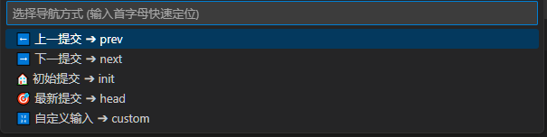

# GitNav: Git-Commit-Navigator for Visual Studio Code
A VS Code extension for navigating between Git commits easily.

## Warning
This plugin is too simple to use in develop or production environment.
It should only be used to help understanding big project.

## Usage

### Commands

### Panel
